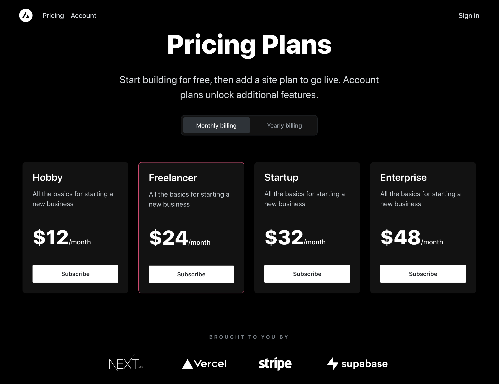
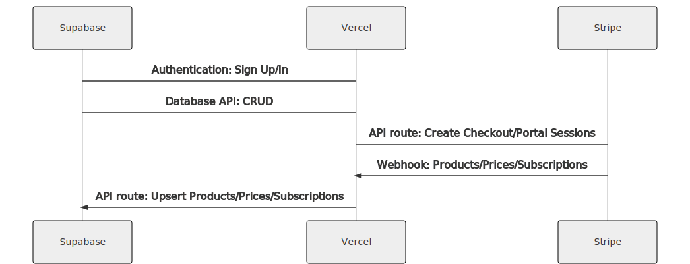

# SUXA členská platforma

## Features

- Secure user management and authentication with [Supabase](https://supabase.io/docs/guides/auth)
- Powerful data access & management tooling on top of PostgreSQL with [Supabase](https://supabase.io/docs/guides/database)
- Integration with [Stripe Checkout](https://stripe.com/docs/payments/checkout) and the [Stripe customer portal](https://stripe.com/docs/billing/subscriptions/customer-portal)
- Automatic syncing of pricing plans and subscription statuses via [Stripe webhooks](https://stripe.com/docs/webhooks)

## Demo

- https://subscription-payments.vercel.app/

[](https://subscription-payments.vercel.app/)

## Architecture



## Develop locally

If you haven't already done so, clone your Github repository to your local machine.

Next, use the [Vercel CLI](https://vercel.com/download) to link your project:

```bash
vercel login
vercel link
```

### Setting up the env vars locally

Use the Vercel CLI to download the development env vars:

```bash
vercel env pull .env.local
```

Running this command will create a new `.env.local` file in your project folder. For security purposes, you will need to set the `SUPABASE_SERVICE_ROLE_KEY` manually from your [Supabase dashboard](https://app.supabase.io/) (`Settings > API`).

### Use the Stripe CLI to test webhooks

[Install the Stripe CLI](https://stripe.com/docs/stripe-cli) and [link your Stripe account](https://stripe.com/docs/stripe-cli#login-account).

Next, start local webhook forwarding:

```bash
stripe listen --forward-to=localhost:3000/api/webhooks
```

Running this Stripe command will print a webhook secret (such as, `whsec_***`) to the console. Set `STRIPE_WEBHOOK_SECRET` to this value in your `.env.local` file.

### Install dependencies and run the Next.js client

In a separate terminal, run the following commands to install dependencies and start the development server:

```bash
npm install
npm run dev
# or
yarn
yarn dev
```

Note that webhook forwarding and the development server must be running concurrently in two separate terminals for the application to work correctly.

Finally, navigate to [http://localhost:3000](http://localhost:3000) in your browser to see the application rendered.


